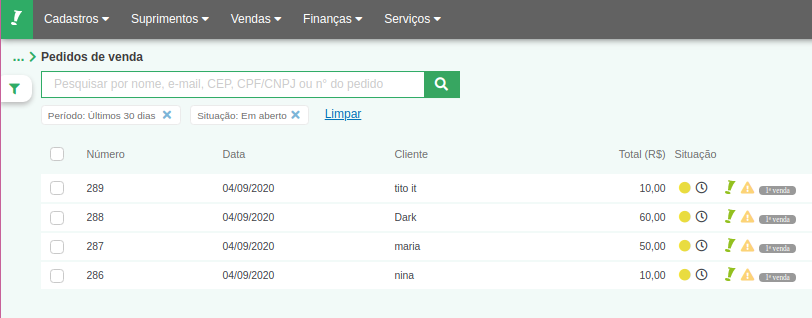
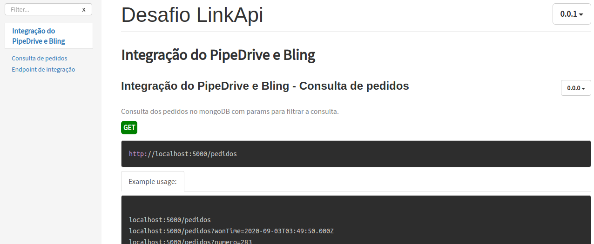

# Integração de pedidos com status won Pipedrive com Bling
> Descrição curta sobre o que seu projeto faz.

[![NPM Version][npm-image]][npm-url]


Este projeto projeto foi feito com o intuito de integrar os pedidos com status won do PipeDrive com o Bling. 



## Instalação do projeto

OS X & Linux:

```sh
npm install 
```


## Inicialização do projeto.

```sh
npm run dev
```


## Link da documenteção após a inicialização do projeto.

```sh
http://localhost:5000/doc/
```



[npm-image]: https://img.shields.io/npm/v/datadog-metrics.svg?style=flat-square
[npm-url]: https://npmjs.org/package/datadog-metrics
[npm-downloads]: https://img.shields.io/npm/dm/datadog-metrics.svg?style=flat-square
[travis-image]: https://img.shields.io/travis/dbader/node-datadog-metrics/master.svg?style=flat-square
[travis-url]: https://travis-ci.org/dbader/node-datadog-metrics
[wiki]: https://github.com/seunome/seuprojeto/wiki

Fim